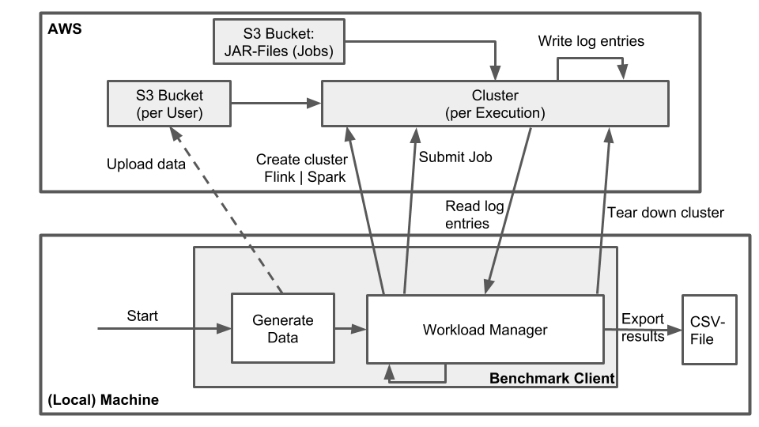

# Parallel Batch Processing: Apache Spark and Apache Flink Benchmark
Benchmark tool to measure the throughput and runtime for Flink and Spark for given workloads. The major goal of this project is to find answer for the following research question:

> Measure throughput and runtime (for Group-By, Sorting, Aggregate) of Flink and Spark clusters on different input sizes and fixed structures (Book-Store) on fixed comparable systems and comparing the results.

The answer can be found [here](#documentation).

## Architecture

The bucket which contains the JAR-files is a public AWS-S3-Bucket.

## Benchmark Client
TODO short description

### Input Parameters
TODO list of all parameters

## Workloads/Metrics
We defined the following fixed data structure (CSV file):

`id, userId, title, genre, author, pages, publisher, date, price`

This structure is used to perform the following workload jobs on each cluster type (Flink | Spark) for different input sizes:
- Group-By: genre, count per group | [Flink implementation](Metrics/Flink-GroupBy/Readme.md), [Spark implementation](https://www.google.com/search?ei=ooZFXJfrNY_ZwQLd46nwCw&q=todo&oq=todo&gs_l=psy-ab.3..0i67j0i20i263l2j0l2j0i131j0l3j0i131.498175.498588..498839...0.0..0.62.232.4......0....1..gws-wiz.......0i71j35i39.iNYnyrcTGss)
- Sorting: number of pages (ascending) | [Flink implementation](Metrics/Flink-Sorting/Readme.md), [Spark implementation](https://www.google.com/search?ei=ooZFXJfrNY_ZwQLd46nwCw&q=todo&oq=todo&gs_l=psy-ab.3..0i67j0i20i263l2j0l2j0i131j0l3j0i131.498175.498588..498839...0.0..0.62.232.4......0....1..gws-wiz.......0i71j35i39.iNYnyrcTGss)
- Aggregation: price (max) | [Flink implementation](Metrics/Flink-Aggregation/Readme.md), [Spark implementation](https://www.google.com/search?ei=ooZFXJfrNY_ZwQLd46nwCw&q=todo&oq=todo&gs_l=psy-ab.3..0i67j0i20i263l2j0l2j0i131j0l3j0i131.498175.498588..498839...0.0..0.62.232.4......0....1..gws-wiz.......0i71j35i39.iNYnyrcTGss)

When the jobs are done, the system will collect the runtime and throughput (=metrics) for each job.

## Documentation

[Report](https://www.overleaf.com/project/5c48853d95d38a3a6ff877b9)

[Poster](docs/Poster.pdf)
